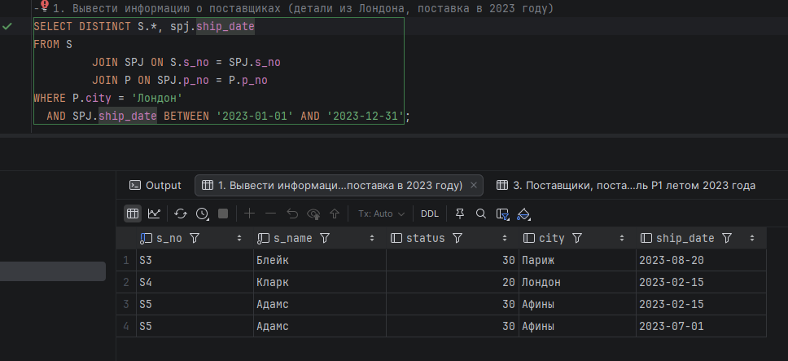
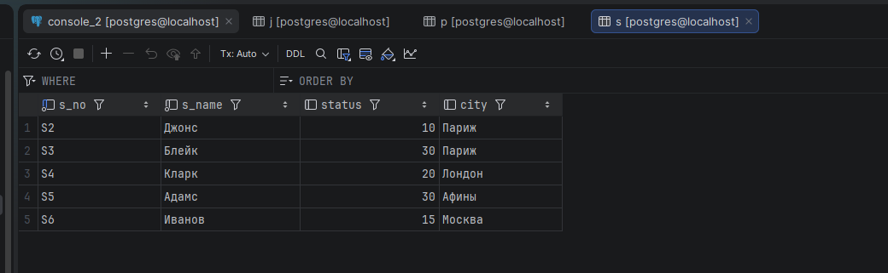
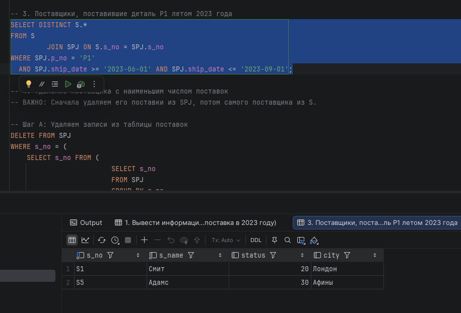
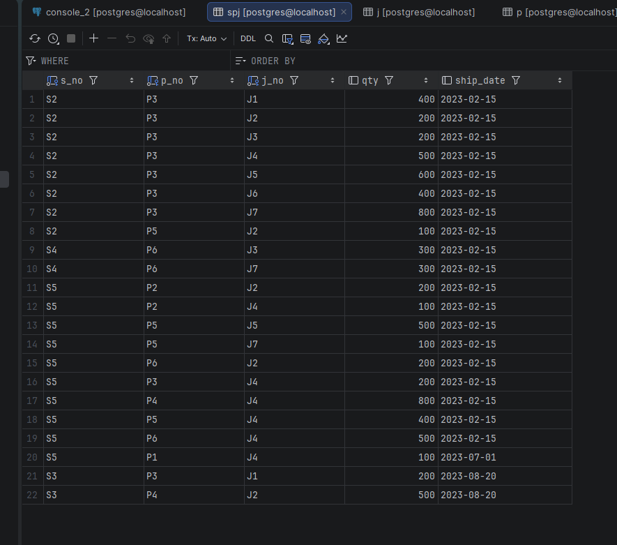
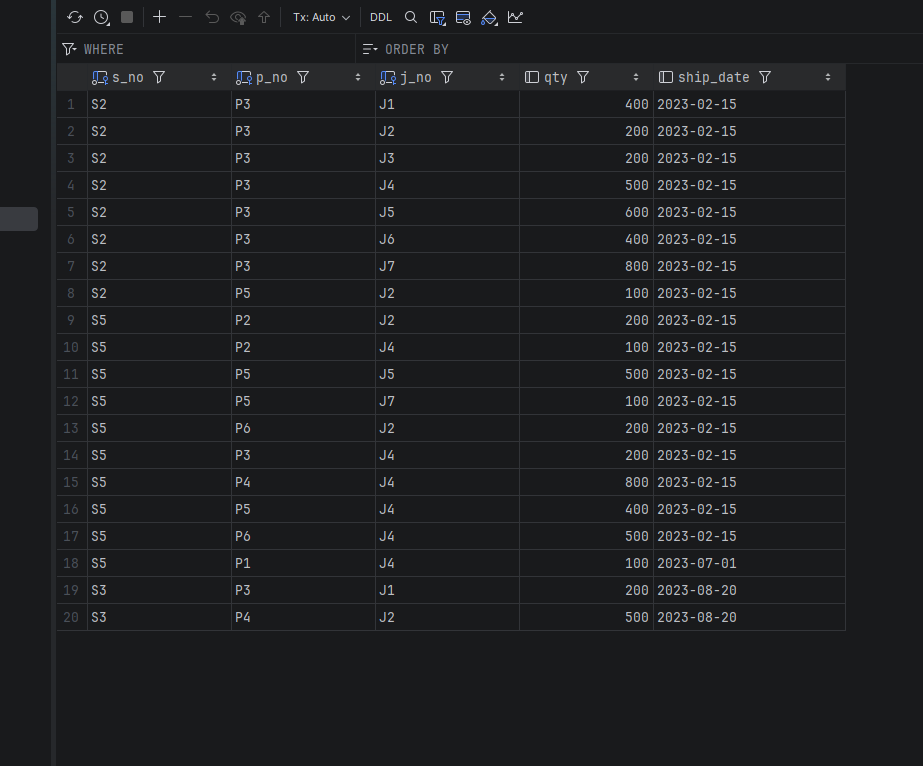

<div>
<h1 align="center">
Вариант 15 Хабибуллин Артём Альбертович
</h1>
<h2 align="center">
Описание задания
</h2>
</div>

---

## Описание базы данных

База данных **db_details** содержит информацию о страховой компании и включает следующие таблицы:

| Таблица             | Описание                                        |
| ------------------- | ----------------------------------------------- |
| **spj** | Связанная табличка |
| **j** | Продукс |
| **s** | Поставщик |
| **p** | Деталь |

### Параметры в табличке продукты
| Колонка| Описание |
| - | - |
| **j_name** | Название продукта  |
| **j.city** | Название продукта  |

### Параметры в табличке детали
| Колонка| Описание |
| - | - |
| **p_name** | Название детали  |
| **p.color** | Цвет детали |
| **p.weight** | Ширина |
| **p.city** | Город изгатоваления |

### Параметры в табличке поставщики
| Колонка| Описание |
| - | - |
| **s_name** | Фамилия поставщика |
| **s.status** | Рейтинг |
| **s.city** | Город |

### Параметры основной связной таблицы
| Колонка| Описание |
| - | - |
| **s** | Поставщики |
| **p** | Детали |
| **j** | Продукты |
| **qty** | кол-во |


---

## <div style="background-color: #aa50ff; height:30px; border-radius: 100px 30px; text-align: center; color: #ffffff"> Вывести все выделенные по переуду </div>

### Описание

Вывести информацию о поставщиках, которые осуществляли поставки деталей из заданного города в указанный период. 

#### PostgreSQL

```sql
-- 1. Добавляем колонку даты в таблицу SPJ
ALTER TABLE SPJ ADD ship_date DATE;

-- 2. Заполняем существующие записи датами (чтобы запросы возвращали результат)
-- Сначала ставим всем 2023 год
UPDATE SPJ SET ship_date = '2023-02-15';

-- Обновим несколько записей на лето 2023 (чтобы сработал запрос №3 про период июнь-сентябрь)
UPDATE SPJ SET ship_date = '2023-07-01' WHERE p_no = 'P1';
UPDATE SPJ SET ship_date = '2023-08-20' WHERE s_no = 'S3';

SELECT DISTINCT S.*
FROM S
         JOIN SPJ ON S.s_no = SPJ.s_no
         JOIN P ON SPJ.p_no = P.p_no
WHERE P.city = 'Лондон'
  AND SPJ.ship_date BETWEEN '2023-01-01' AND '2023-12-31'; 
```

### Скриншоты выполнения

> **PostgreSQL:**
> 

---

## <div style="background-color: #aa50ff; height:30px; border-radius: 100px 30px; text-align: center; color: #ffffff"> Вставка поставщика </div>

### Описание

Вставить поставщика с заданными параметрами.

#### PostgreSQL

```sql
INSERT INTO S (s_no, s_name, status, city)
VALUES ('S6', 'Иванов', 15, 'Москва');
```

### Скриншоты выполнения

> **PostgreSQL:**
> 

---

## <div style="background-color: #aa50ff; height:30px; border-radius: 100px 30px; text-align: center; color: #ffffff"> Выделить поставщиков по дате </div>

### Описание

Вывести информацию о поставщиках, поставивших указанную деталь в заданный период. 

#### PostgreSQL

```sql
SELECT DISTINCT S.*
FROM S
         JOIN SPJ ON S.s_no = SPJ.s_no
WHERE SPJ.p_no = 'P1'
  AND SPJ.ship_date >= '2023-06-01' AND SPJ.ship_date <= '2023-09-01';
```

### Скриншоты выполнения

> **PostgreSQL:**
> 

---

## <div style="background-color: #aa50ff; height:30px; border-radius: 100px 30px; text-align: center; color: #ffffff"> Удаление </div>

### Описание

Удалить поставщика, выполнившего меньше всего поставок.

#### PostgreSQL

```sql
-- 4. Удаление поставщика с наименьшим числом поставок
-- ВАЖНО: Сначала удаляем его поставки из SPJ, потом самого поставщика из S.

-- Шаг А: Удаляем записи из таблицы поставок
DELETE FROM SPJ
WHERE s_no = (
    SELECT s_no FROM (
                         SELECT s_no
                         FROM SPJ
                         GROUP BY s_no
                         ORDER BY COUNT(*) ASC
                             LIMIT 1
                     ) AS subquery
);

-- Шаг Б: Удаляем самого поставщика
DELETE FROM S
WHERE s_no = (
    SELECT s_no FROM (
                         SELECT s_no FROM S WHERE s_no NOT IN (SELECT DISTINCT s_no FROM SPJ)
                             LIMIT 1
                     ) AS subquery
);
```

### Скриншоты выполнения

> **PostgreSQL: До выполнения**
> 

> **PostgreSQL: После выполнения**
> 
---