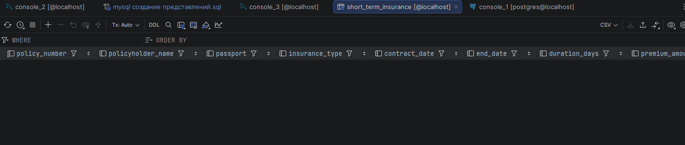
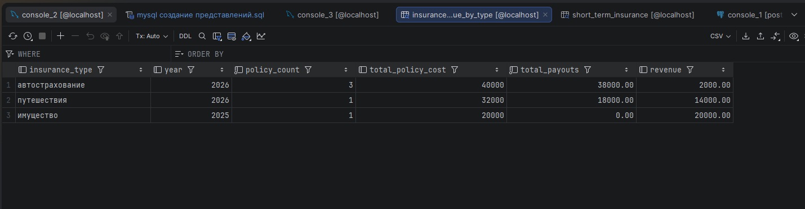
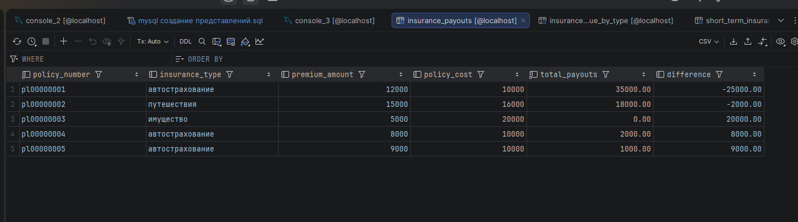
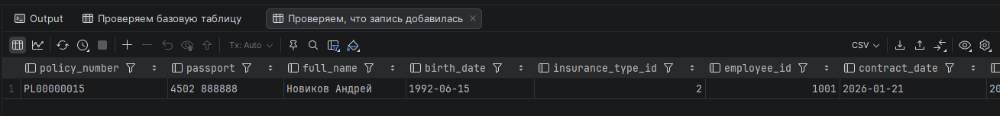
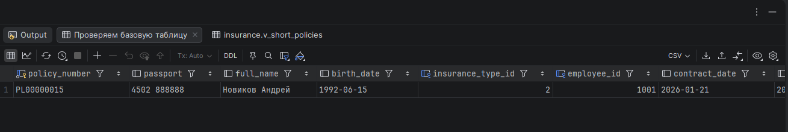
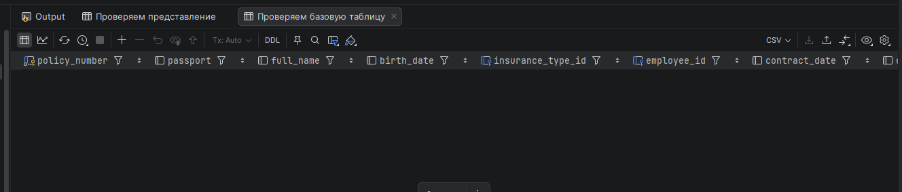

<div>
<h1 align="center">
Вариант 15 Хабибуллин Артём Альбертович
</h1>
<h2 align="center">
Создание представлений и операции с представлениями базы данных страхования
</h2>
</div>

---

## Оглавление
1. [Описание базы данных](#описание-базы-данных)
2. [Представление 1: Кратковременное страхование](#представление-1-кратковременное-страхование)
3. [Представление 2: Доходы по видам страхования](#представление-2-доходы-по-видам-страхования)
4. [Представление 3: Страховые выплаты](#представление-3-страховые-выплаты)
5. [Операции INSERT через представления](#операции-insert-через-представления)
6. [Операции UPDATE через представления](#операции-update-через-представления)
7. [Операции DELETE через представления](#операции-delete-через-представления)

---

## Описание базы данных

База данных **insurance** содержит информацию о страховой компании и включает следующие таблицы: 

| Таблица | Описание |
|---------|----------|
| **insurance_types** | Виды страхования (авто, путешествия, имущество) |
| **employees** | Сотрудники страховой компании |
| **policyholders** | Страхователи и их полисы |
| **claims** | Страховые случаи и выплаты |

### Структура связей:
```
insurance_types ──┐
                  ├──> policyholders ──> claims
employees ────────┘
```

---

## Представление 1: Кратковременное страхование

> Данное представление выводит все полисы с **продолжительностью не более 2-х недель (14 дней)**
>
> Полезно для анализа краткосрочных договоров страхования (например, туристические полисы)

### SQL код создания представления

```sql
CREATE OR REPLACE VIEW short_term_insurance AS
SELECT 
    p.policy_number,
    p.full_name AS policyholder_name,
    p.passport,
    it.name AS insurance_type,
    it.insurance_type_id,
    p.contract_date,
    p.end_date,
    DATEDIFF(p.end_date, p.contract_date) AS duration_days,
    p.premium_amount,
    p.policy_cost,
    p.employee_id,
    e.full_name AS employee_name,
    p.birth_date
FROM policyholders p
JOIN insurance_types it ON it.insurance_type_id = p.insurance_type_id
JOIN employees e ON e.employee_id = p.employee_id
WHERE DATEDIFF(p.end_date, p.contract_date) <= 14
ORDER BY p.contract_date DESC;
```

### Описание полей представления

| Поле | Описание |
|------|----------|
| `policy_number` | Номер страхового полиса (PRIMARY KEY) |
| `policyholder_name` | ФИО страхова��еля |
| `passport` | Паспортные данные |
| `insurance_type` | Вид страхования |
| `insurance_type_id` | ID вида страхования |
| `contract_date` | Дата заключения договора |
| `end_date` | Дата окончания действия полиса |
| `duration_days` | **Продолжительность в днях** (≤ 14) |
| `premium_amount` | Сумма страховой премии |
| `policy_cost` | Стоимость полиса |
| `employee_id` | ID сотрудника |
| `employee_name` | ФИО сотрудника, офо��мившего полис |
| `birth_date` | Дата рождения страхователя |

### Пример использования представления

```sql
-- Вывести все кратковременные полисы
SELECT * FROM short_term_insurance;
```

### Результат выполнения запроса



**Объяснение:**
- В представлении отображаются только полисы, у которых `duration_days ≤ 14`
- Например, полис на 7 дней для туристической поездки
- Автоматически фильтруются записи при добавлении новых пол��сов

---

## Представление 2: Доходы по видам страхования

> Данное представление показывает **финансовую статистику по каждому виду страхования**
>
> Группировка по виду страхования и году, с расчётом дохода

### SQL код создания представления

```sql
CREATE OR REPLACE VIEW insurance_revenue_by_type AS
SELECT 
    it.insurance_type_id,
    it.name AS insurance_type,
    YEAR(p.contract_date) AS year,
    COUNT(DISTINCT p.policy_number) AS policy_count,
    SUM(p.policy_cost) AS total_policy_cost,
    COALESCE(SUM(c.payout), 0) AS total_payouts,
    SUM(p.policy_cost) - COALESCE(SUM(c.payout), 0) AS revenue
FROM insurance_types it
LEFT JOIN policyholders p ON p.insurance_type_id = it.insurance_type_id
LEFT JOIN claims c ON c.policy_number = p.policy_number
WHERE p.policy_number IS NOT NULL
GROUP BY it. insurance_type_id, it. name, YEAR(p.contract_date)
ORDER BY year DESC, insurance_type;
```

### Описание полей представления

| Поле | Описание | Формула |
|------|----------|---------|
| `insurance_type_id` | ID вида страхования | - |
| `insurance_type` | Вид страхования | - |
| `year` | Год заключения договоров | `YEAR(contract_date)` |
| `policy_count` | Количество полисов | `COUNT(DISTINCT policy_number)` |
| `total_policy_cost` | Суммарная стоимость полисов | `SUM(policy_cost)` |
| `total_payouts` | Сумма страховых выплат | `SUM(payout)` |
| `revenue` | **Доход компании** | `total_policy_cost - total_payouts` |

### Пример использования представления

```sql
-- Показать доходы по всем видам страхования
SELECT * FROM insurance_revenue_by_type;
```

```sql
-- Показать только прибыльные виды страхования (доход > 10000)
SELECT * FROM insurance_revenue_by_type
WHERE revenue > 10000
ORDER BY revenue DESC;
```

### Результат выполнения запроса



**Примечание:** Данное представление использует агрегатные функции и GROUP BY, поэтому **не поддерживает прямые операции INSERT/UPDATE/DELETE**. 

---

## Представление 3: Страховые выплаты

> Детальная информация по **каждому полису** с расчётом выплат и остатка
>
> Показывает разницу между стоимостью полиса и суммой страховых выплат

### SQL код создания представления

```sql
CREATE OR REPLACE VIEW insurance_payouts AS
SELECT 
    p.policy_number,
    it.name AS insurance_type,
    it.insurance_type_id,
    p.premium_amount,
    p.policy_cost,
    COALESCE(SUM(c.payout), 0) AS total_payouts,
    p.policy_cost - COALESCE(SUM(c.payout), 0) AS difference
FROM policyholders p
JOIN insurance_types it ON it.insurance_type_id = p.insurance_type_id
LEFT JOIN claims c ON c.policy_number = p.policy_number
GROUP BY 
    p.policy_number, 
    it.name,
    it.insurance_type_id,
    p.premium_amount, 
    p.policy_cost
ORDER BY p.policy_number;
```

### Описание полей представления

| Поле | Описание |
|------|----------|
| `policy_number` | Номер страхового полиса |
| `insurance_type` | Вид страхования |
| `insurance_type_id` | ID вида страхования |
| `premium_amount` | Сумма страховой премии |
| `policy_cost` | Стоимость полиса |
| `total_payouts` | Сумма страховых выплат |
| `difference` | **Остаток покрытия** (`policy_cost - total_payouts`) |

### Пример использования представления

```sql
-- Показать все полисы с выплатами
SELECT * FROM insurance_payouts;
```

```sql
-- Показать полисы, где выплаты превысили стоимость полиса (убыточные)
SELECT * FROM insurance_payouts
WHERE difference < 0
ORDER BY difference;
```

### Результат выполнения запроса



**Примечание:** Данное представление использует агрегатную функцию SUM и GROUP BY, поэтому **не поддерживает прямые операции INSERT/UPDATE/DELETE**.

---

## Операции INSERT через представления

> В MySQL можно выполнять INSERT через представления, **если представление основано на одной таблице** и не содержит агрегатных функций, GROUP BY, DISTINCT и т.д.

### Важно: Ограничения для INSERT через VIEW

| Представление | Можно ли INSERT?  | Причина |
|---------------|------------------|---------|
| `short_term_insurance` | ❌ НЕТ | Содержит JOIN нескольких таблиц |
| `insurance_revenue_by_type` | ❌ НЕТ | Содержит GROUP BY и агрегацию |
| `insurance_payouts` | ❌ НЕТ | Содержит GROUP BY и агрегацию |

### Создадим дополнительное UPDATABLE представление для демонстрации INSERT

```sql
-- Простое представление на основе одной таблицы (UPDATABLE)
CREATE OR REPLACE VIEW v_policyholders_simple AS
SELECT 
    policy_number,
    passport,
    full_name,
    birth_date,
    insurance_type_id,
    employee_id,
    contract_date,
    end_date,
    premium_amount,
    policy_cost
FROM policyholders;
```

### Пример 1: INSERT через представление v_policyholders_simple

```sql
-- Добавление нового полиса через представление
INSERT INTO v_policyholders_simple 
    (policy_number, passport, full_name, birth_date, insurance_type_id, 
     employee_id, contract_date, end_date, premium_amount, policy_cost)
VALUES 
    ('PL00000015', '4502 888888', 'Новиков Андрей', DATE '1992-06-15', 2, 1001,
     CURDATE(), DATE_ADD(CURDATE(), INTERVAL 10 DAY), 4000, 6000);
```

**Проверка результата:**

```sql
-- Проверяем, что запись добавилась
SELECT * FROM v_policyholders_simple WHERE policy_number = 'PL00000015';

-- Проверяем базовую таблицу
SELECT * FROM policyholders WHERE policy_number = 'PL00000015';
```



**Объяснение:**
- INSERT выполнен **через представление** `v_policyholders_simple`
- Данные автоматически добавились в базовую таблицу `policyholders`
- Если полис имеет срок ≤ 14 дней, он появится в `short_term_insurance`


## Операции UPDATE через представления

### Создадим UPDATABLE представление для UPDATE

```sql
-- Представление для кратковременного страхования без JOIN
CREATE OR REPLACE VIEW v_short_policies AS
SELECT 
    policy_number,
    full_name,
    passport,
    insurance_type_id,
    employee_id,
    contract_date,
    end_date,
    DATEDIFF(end_date, contract_date) AS duration_days,
    premium_amount,
    policy_cost
FROM policyholders
WHERE DATEDIFF(end_date, contract_date) <= 14;
```

### Пример 1: UPDATE через представление v_short_policies

```sql
-- Обновляем стоимость полиса через представление
UPDATE v_short_policies
SET policy_cost = 7000,
    premium_amount = 5500
WHERE policy_number = 'PL00000015';
```

**Проверка результата:**

```sql
-- Проверяем изменения в представлении
SELECT * FROM v_short_policies WHERE policy_number = 'PL00000015';

-- Проверяем базовую таблицу
SELECT * FROM policyholders WHERE policy_number = 'PL00000015';
```



**Объяснение:**
- UPDATE выполнен **через представление** `v_short_policies`
- Изменения автоматически применились к базовой таблице `policyholders`
- Вычисляемое поле `duration_days` **нельзя обновить** (оно рассчитывается автоматически)

---

## Операции DELETE через представления

### Пример 1: DELETE через представление v_short_policies

```sql
-- Удаляем кратковременный полис через представление
DELETE FROM v_short_policies
WHERE policy_number = 'PL000000015';
```

**Важно:** Сначала нужно удалить связанные страховые случаи!

```sql
-- Правильный порядок удаления: 

-- Шаг 1: Удаляем страховые случаи
DELETE FROM claims
WHERE policy_number = 'PL000000015';

-- Шаг 2: Удаляем полис через представление
DELETE FROM v_short_policies
WHERE policy_number = 'PL000000015';
```

**Проверка результата:**

```sql
-- Проверяем представление
SELECT * FROM v_short_policies WHERE policy_number = 'PL000000015';
-- Результат: 0 строк

-- Проверяем базовую таблицу
SELECT * FROM policyholders WHERE policy_number = 'PL000000015';
-- Результат: 0 строк
```



---

## Проверка обновляемости представлений
---

## Итоговая таблица возможностей представлений

| Представление | Основа | GROUP BY | JOIN | INSERT | UPDATE | DELETE |
|---------------|--------|----------|------|--------|--------|--------|
| `short_term_insurance` | Несколько таблиц | ❌ | ✅ | ❌ | ❌ | ❌ |
| `insurance_revenue_by_type` | Несколько таблиц | ✅ | ✅ | ❌ | ❌ | ❌ |
| `insurance_payouts` | Несколько таблиц | ✅ | ✅ | ❌ | ❌ | ❌ |
| `v_policyholders_simple` | Одна таблица | ❌ | ❌ | ✅ | ✅ | ✅ |
| `v_short_policies` | Одна таблица | ❌ | ❌ | ✅ | ✅ | ✅ |

---
