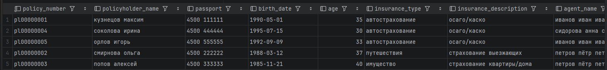
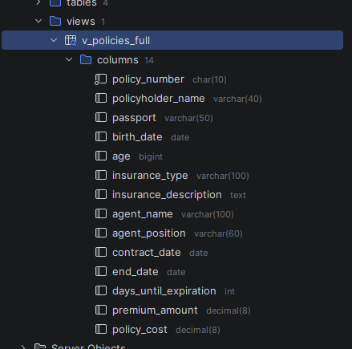
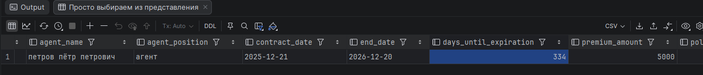

<div>
<h1 align="center">
Вариант 15 Хабибуллин Артём Альбертович
<h1>
<h2 align="center">
Создание представления
</h2>
</div>

## Первое представление

> Данный код выводит представление со всеми данными в моём заданий 
>
> В данном случае код берёт все данные из таблиц
>
> __policyhoders__ - Люди которые взяли страхровку
> 
> __employers__ - Работники 
>
> __it(inseruance-type)__ - типы страхования
```sql

CREATE  VIEW  v_policies_full AS
SELECT
    p.policy_number,
    p.full_name AS policyholder_name,
    p.passport,
    p.birth_date,
    TIMESTAMPDIFF(YEAR, p.birth_date, CURDATE()) AS age,
    it.name AS insurance_type,
    it.description AS insurance_description,
    e.full_name AS agent_name,
    e.position AS agent_position,
    p.contract_date,
    p.end_date,
    DATEDIFF(p.end_date, CURDATE()) AS days_until_expiration,
    p.premium_amount,
    p.policy_cost
FROM policyholders p
JOIN insurance_types it ON p.insurance_type_id = it.insurance_type_id
JOIN employees e ON p.employee_id = e.employee_id;


```

### Изображение вывод данных во представления

### В представления выводяться данные поля

---

## Вывод представления

### Например выводим всех у кого дней до истечения срока

```sql
SELECT * FROM v_policies_full
WHERE days_until_expiration < 350
ORDER BY days_until_expiration;
```

#### Изображение вывело 1 пользователя у которого дней до истечения срока 334 это меньше 350

