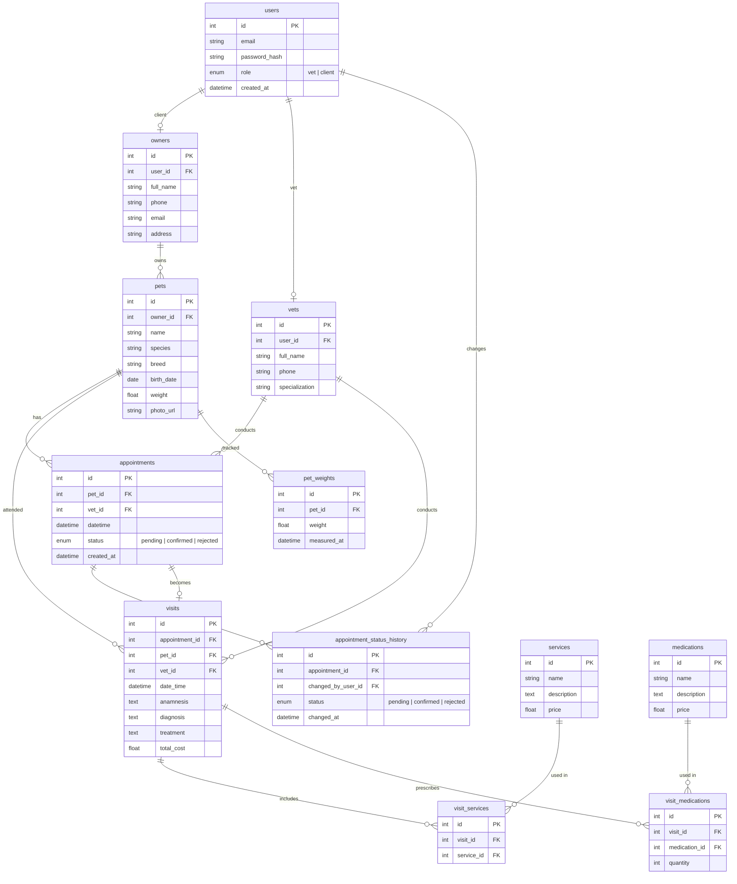

# 🐾 Vet Clinic — Информационная система учёта посещений

Веб-приложение для автоматизации работы ветеринарной клиники.  
Стек: **Vue 3 + TypeScript** (frontend) · **NestJS + TypeORM** (backend)

---

## ER-диаграмма базы данных



---

## Роли

| Роль | Описание |
|---|---|
| `client` | Регистрируется сам, управляет питомцами, записывается на приём |
| `vet` | Ведёт приём, заполняет диагнозы, назначает лечение |

---

## Модули

| Модуль | Описание |
|---|---|
| `auth` | Регистрация, логин, JWT |
| `users` | Управление пользователями |
| `owners` | Владельцы животных |
| `vets` | Ветеринары |
| `pets` | Животные, фото, вес |
| `appointments` | Записи на приём, статусы |
| `visits` | Визиты, диагнозы, лечение |
| `services` | Справочник услуг |
| `medications` | Справочник лекарств |
| `stats` | Статистика и графики |

---

## Запуск

```bash
# Установка зависимостей
cd frontend && npm install
cd ../backend && npm install

# Запуск (из корня проекта)
startServer.bat
```

Swagger UI доступен по адресу: `http://localhost:3000/api/docs`