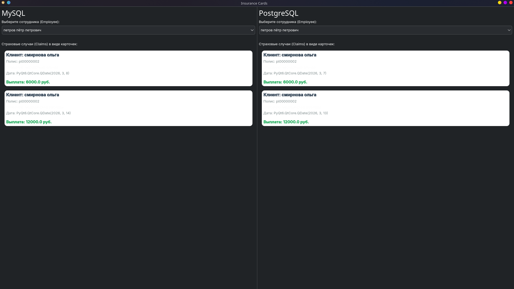
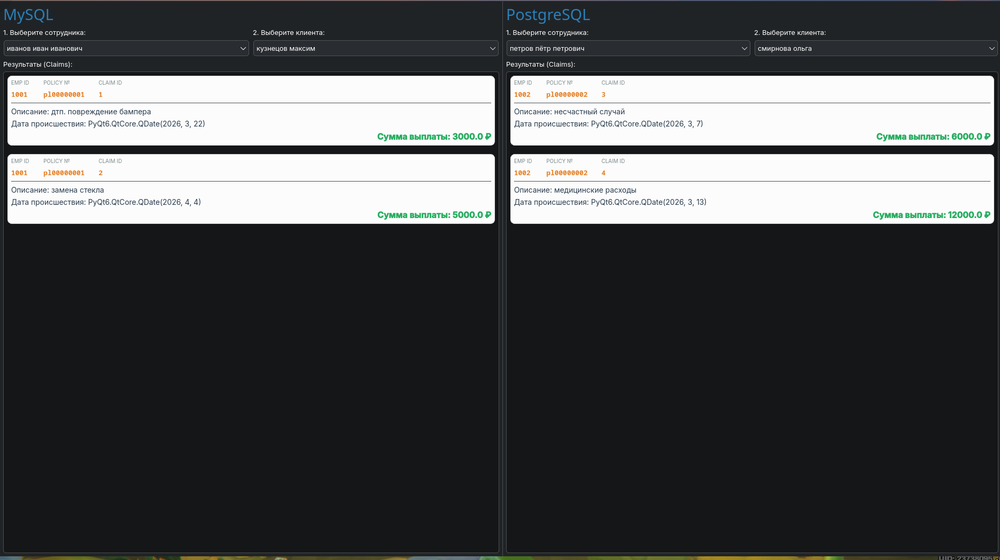

# Отчёт (Python + SQL + C# Avalonia)

## Оглавление
1. [first.py — связанные таблицы](#1-firstpy--связанные-таблицы)
2. [second.py — выбор через выпадающий список](#2-secondpy--выбор-через-выпадающий-список)
3. [third.py — двойной фильтр данных](#3-thirdpy--двойной-фильтр-данных)
4. [fourth.py — вывод в виде карточек](#4-fourthpy--вывод-в-виде-карточек)
5. [fiveth.py — детальные карточки с ключами](#5-fivethpy--детальные-карточки-с-ключами)
6. [SecondApplication — двойной фильтр + DataGrid (C#)](#6-secondapplication--двойной-фильтр--datagrid-c)
7. [ThirdApplication — двойной фильтр + карточки (C#)](#7-thirdapplication--двойной-фильтр--карточки-c)
8. [Общий итог](#общий-итог)

---

## Общая информация

### Используемые технологии
- Python
- PyQt6 (`QtWidgets`, `QtSql`)
- Работа с СУБД через `QSqlDatabase`, `QSqlQuery`, модели (`QSqlQueryModel`) и представления (`QTableView`)
- C# (.NET 10), Avalonia UI 11
- Entity Framework Core 9 (`FromSqlRaw`, `DbContext`)
- Pomelo.EntityFrameworkCore.MySql 9, Npgsql.EntityFrameworkCore.PostgreSQL 9

### Подключения к базам данных
В ряде скриптов используется подключение к двум СУБД: MySQL (через драйвер `QMARIADB`) и PostgreSQL (через `QPSQL`).

```python
MYSQL_HOST, MYSQL_DB, MYSQL_USER, MYSQL_PASS = "127.0.0.1", "insurance", "root", "1234"
PG_HOST, PG_DB, PG_USER, PG_PASS = "127.0.0.1", "insurance", "postgres", "1234"
```

В C# приложениях подключение реализовано через EF Core контексты, сгенерированные командой `scaffold`:

```bash
dotnet ef dbcontext scaffold \
  "Server=127.0.0.1;Database=insurance;User=root;Password=1234;" \
  Pomelo.EntityFrameworkCore.MySql -o Models/MySQL -f

dotnet ef dbcontext scaffold \
  "Host=127.0.0.1;Database=insurance;Username=postgres;Password=1234;" \
  Npgsql.EntityFrameworkCore.PostgreSQL -o Models/PostgreSQL -f
```

### Инфраструктура: Docker
Обе СУБД запущены в Docker контейнерах:

```bash
docker run -d --name mysql \
  -e MYSQL_ROOT_PASSWORD=1234 -e MYSQL_DATABASE=insurance \
  -p 3306:3306 mysql:latest

docker run -d --name postgres \
  -e POSTGRES_PASSWORD=1234 -e POSTGRES_DB=insurance \
  -p 5432:5432 postgres:latest
```

---

## 1. first.py — связанные таблицы

### Цель
Показать работу с данными в формате «мастер → детали»: список сотрудников и связанные с ними страховые случаи.

### Библиотеки и компоненты
- `PyQt6`
- `PyQt6.QtSql`
- UI: `QTableView`, `QSqlQueryModel`

### Подключение к СУБД
Пример инициализации двух подключений:

```python
db_ms = QSqlDatabase.addDatabase("QMARIADB", "mysql_conn")
db_pg = QSqlDatabase.addDatabase("QPSQL", "pg_conn")
# ... установка параметров и открытие .open()
```

### Отображение данных
Табличный вывод через модель запросов:

```python
self.master_model.setQuery(SQL_EMPLOYEES)
self.master_view.setModel(self.master_model)
```

### Результат (скриншот)


### Итог
Скрипт демонстрирует одновременную работу с MySQL и PostgreSQL и классический подход вывода данных через таблицы.

---

## 2. second.py — выбор через выпадающий список

### Цель
Сделать интерфейс компактнее: вместо верхней таблицы (мастер-списка) использовать выбор сотрудника через `QComboBox`.

### Библиотеки и компоненты
- `PyQt6`
- драйверы: `QMARIADB`, `QPSQL`
- UI: `QComboBox`, модель на основе `QSqlQueryModel`

### Подключение к СУБД
Используются те же параметры подключения, что и в `first.py`.
Инициализация выполняется при запуске главного окна через `QSqlDatabase.addDatabase`.

### Отображение данных
Привязка `QComboBox` к модели сотрудников:

```python
self.employee_combo = QComboBox()
self.employee_combo.setModel(self.master_model)
self.employee_combo.setModelColumn(1)
```

### Результат (скриншот)


### Итог
Использование выпадающего списка упрощает выбор сотрудника и экономит место в интерфейсе.

---

## 3. third.py — двойной фильтр данных

### Цель
Реализовать двухступенчатую фильтрацию:
1) выбор сотрудника  
2) выбор клиента сотрудника  
3) вывод страховых случаев клиента

### Библиотеки и компоненты
- `PyQt6.QtSql`

### Подключение к СУБД
Стандартное подключение к базе `insurance`.

### Логика фильтрации (пример запроса)
```python
query.prepare("SELECT policy_number, full_name FROM policyholders WHERE employee_id = :emp_id")
query.bindValue(":emp_id", emp_id)
query.exec()
```

### Результат (скриншот)


### Итог
Двойная фильтрация позволяет быстрее находить нужные данные при большом объёме записей.

---

## 4. fourth.py — вывод в виде карточек

### Цель
Заменить табличное представление на карточный интерфейс для более наглядного отображения информации.

### Библиотеки и компоненты
- `PyQt6`
- UI: `QFrame`, `QScrollArea`
- пользовательский виджет: `ClaimCard`

### Подключение к СУБД
Используются параметры для MySQL и PostgreSQL (аналогично предыдущим вариантам).

### Отображение данных (генерация карточек)
```python
while query.next():
    card = ClaimCard(client_name=query.value("client_name"), ...)
    self.cards_layout.addWidget(card)
```

### Результат (скриншот)


### Итог
Карточный интерфейс выглядит современнее и может быть удобнее таблицы для восприятия отдельных записей.

---

## 5. fiveth.py — детальные карточки с ключами

### Цель
Улучшить карточный интерфейс: добавить больше технических полей (ID, номера) и усилить визуальное оформление.

### Библиотеки и компоненты
- `PyQt6`
- стилизация через `setStyleSheet`

### Отображение и стилизация (пример)
```python
self.setStyleSheet("ClaimCard { background-color: #fcfcfc; border: 1px solid #d1d1d1; }")
```

### Результат (скриншот)


### Итог
Карточки стали более информативными и лучше читаются за счёт стилизации.

---

## 6. SecondApplication — двойной фильтр + DataGrid (C#)

### Цель
Реализовать аналог `third.py` на C# (Avalonia UI): двухступенчатая фильтрация через два `ComboBox` с выводом страховых случаев в `DataGrid`. Одновременная работа с MySQL и PostgreSQL.

### Библиотеки и компоненты
- `Avalonia UI 11`
- `Avalonia.Controls.DataGrid`
- `Entity Framework Core 9`
- `Pomelo.EntityFrameworkCore.MySql 9`
- `Npgsql.EntityFrameworkCore.PostgreSQL 9`
- UI: `ComboBox`, `DataGrid`

### Подключение к СУБД
Модели и контексты сгенерированы автоматически через `scaffold`:

```bash
dotnet ef dbcontext scaffold \
  "Server=127.0.0.1;Database=insurance;User=root;Password=1234;" \
  Pomelo.EntityFrameworkCore.MySql -o Models/MySQL -f

dotnet ef dbcontext scaffold \
  "Host=127.0.0.1;Database=insurance;Username=postgres;Password=1234;" \
  Npgsql.EntityFrameworkCore.PostgreSQL -o Models/PostgreSQL -f
```

Контексты инициализируются прямо в главном окне:

```csharp
private readonly Models.MySQL.InsuranceContext _mysqlDb = new();
private readonly Models.PostgreSQL.InsuranceContext _pgDb = new();
```

### Логика фильтрации
Данные загружаются через `FromSqlRaw` с параметрами:

```csharp
// Загрузка сотрудников
MysqlEmployeeCombo.ItemsSource = _mysqlDb.Employees
    .FromSqlRaw("SELECT * FROM employees")
    .ToList();

// Загрузка страхователей выбранного сотрудника
MysqlPolicyholderCombo.ItemsSource = _mysqlDb.Policyholders
    .FromSqlRaw("SELECT * FROM policyholders WHERE employee_id = {0}", emp.EmployeeId)
    .ToList();

// Загрузка страховых случаев
MysqlClaimsGrid.ItemsSource = _mysqlDb.Claims
    .FromSqlRaw("SELECT * FROM claims WHERE policy_number = {0}", ph.PolicyNumber)
    .ToList();
```

Привязка отображаемого текста в `ComboBox`:

```csharp
MysqlEmployeeCombo.DisplayMemberBinding = new Avalonia.Data.Binding("FullName");
```

### Результат (скриншот)


### Итог
Приложение демонстрирует двухступенчатую фильтрацию с одновременной работой MySQL и PostgreSQL. `DataGrid` автоматически отображает все поля модели `Claim`.

---

## 7. ThirdApplication — двойной фильтр + карточки (C#)

### Цель
Заменить `DataGrid` на карточный интерфейс через пользовательский `UserControl`. Каждая карточка отображает: фото-заглушку слева, описание и дату в центре, сумму выплаты справа.

### Библиотеки и компоненты
- `Avalonia UI 11`
- `Entity Framework Core 9`
- UI: `ComboBox`, `ItemsControl`, `ScrollViewer`
- пользовательский контрол: `ClaimCard` (UserControl)

### Подключение к СУБД
Аналогично `SecondApplication` — два контекста EF Core для MySQL и PostgreSQL.

### Структура UserControl (ClaimCard)
Карточка реализована как `UserControl` с трёхколоночным `Grid`:

```xml
<Grid ColumnDefinitions="100,*,120">
    <!-- Левая часть: фото-заглушка -->
    <Border Grid.Column="0" Background="#CCCCCC" CornerRadius="8">
        <TextBlock Text="📷" FontSize="32"/>
    </Border>

    <!-- Центр: описание, дата, номер полиса -->
    <StackPanel Grid.Column="1" Margin="15,0">
        <TextBlock Text="{Binding Description}" FontWeight="Bold"/>
        <TextBlock Text="{Binding EventDate, StringFormat='Дата: {0:dd.MM.yyyy}'}"/>
        <TextBlock Text="{Binding PolicyNumber, StringFormat='Полис: {0}'}"/>
    </StackPanel>

    <!-- Правая часть: сумма выплаты -->
    <Border Grid.Column="2" Background="#4CAF50" CornerRadius="8">
        <TextBlock Text="{Binding Payout, StringFormat='{}{0:N0} ₽'}"
                   Foreground="White" FontWeight="Bold"/>
    </Border>
</Grid>
```

### Отображение карточек
Карточки генерируются через `ItemsControl` с `DataTemplate`:

```xml
<ItemsControl x:Name="MysqlClaimsList">
    <ItemsControl.ItemTemplate>
        <DataTemplate>
            <local:ClaimCard/>
        </DataTemplate>
    </ItemsControl.ItemTemplate>
</ItemsControl>
```

Данные передаются через `ItemsSource`:

```csharp
MysqlClaimsList.ItemsSource = _mysqlDb.Claims
    .FromSqlRaw("SELECT * FROM claims WHERE policy_number = {0}", ph.PolicyNumber)
    .ToList();
```

### Результат (скриншот)


### Итог
Карточный интерфейс на Avalonia выглядит современно. `UserControl` позволяет гибко настраивать внешний вид каждой карточки независимо от источника данных.

---

## Общий итог
Проделанная работа показывает, что оба технологических стека — Python (PyQt6) и C# (Avalonia UI) — успешно справляются с задачей разработки приложений для работы с реляционными базами данных MySQL и PostgreSQL.

| Параметр | Python (PyQt6) | C# (Avalonia) |
|---|---|---|
| Генерация моделей | QSqlQueryModel вручную | scaffold автоматически |
| SQL запросы | QSqlQuery + bindValue | FromSqlRaw + параметры |
| Два ComboBox | setModel + setModelColumn | ItemsSource + DisplayMemberBinding |
| Карточки | QFrame + QScrollArea | UserControl + ItemsControl |
| Две СУБД | Два QSqlDatabase | Два DbContext |
| Стилизация | setStyleSheet | XAML стили |

Все варианты интерфейса решают одну задачу (просмотр и фильтрация данных), но отличаются удобством и уровнем визуализации. C# (Avalonia) отличается строгой типизацией и декларативным XAML-интерфейсом, Python (PyQt6) — быстрым стартом и гибкостью при работе с SQL напрямую.
