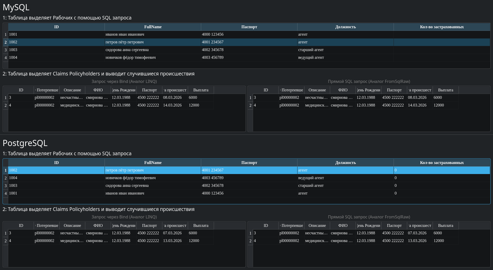
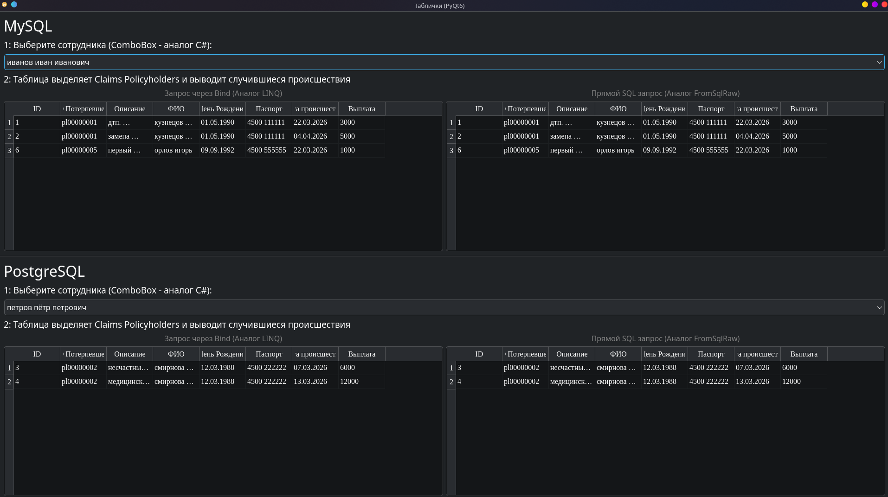
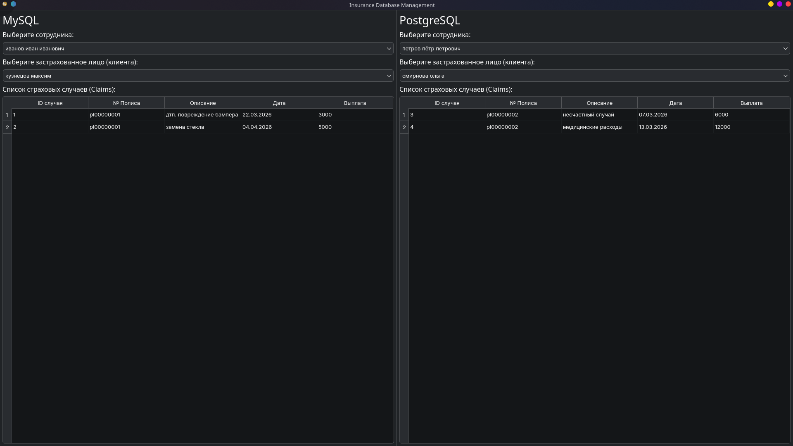

# Отчёт (Python + SQL)

## Оглавление
1. [first.py — связанные таблицы](#1-firstpy--связанные-таблицы)
2. [second.py — выбор через выпадающий список](#2-secondpy--выбор-через-выпадающий-список)
3. [third.py — двойной фильтр данных](#3-thirdpy--двойной-фильтр-данных)
4. [fourth.py — вывод в виде карточек](#4-fourthpy--вывод-в-виде-карточек)
5. [fiveth.py — детальные карточки с ключами](#5-fivethpy--детальные-карточки-с-ключами)
6. [Общий итог](#общий-итог)

---

## Общая информация

### Используемые технологии
- Python
- PyQt6 (`QtWidgets`, `QtSql`)
- Работа с СУБД через `QSqlDatabase`, `QSqlQuery`, модели (`QSqlQueryModel`) и представления (`QTableView`)

### Подключения к базам данных (пример)
В ряде скриптов используется подключение к двум СУБД: MySQL (через драйвер `QMARIADB`) и PostgreSQL (через `QPSQL`).

```python
MYSQL_HOST, MYSQL_DB, MYSQL_USER, MYSQL_PASS = "127.0.0.1", "insurance", "root", "1234"
PG_HOST, PG_DB, PG_USER, PG_PASS = "127.0.0.1", "insurance", "postgres", "1234"
```

---

## 1. first.py — связанные таблицы

### Цель
Показать работу с данными в формате «мастер → детали»: список сотрудников и связанные с ними страховые случаи.

### Библиотеки и компоненты
- `PyQt6`
- `PyQt6.QtSql`
- UI: `QTableView`, `QSqlQueryModel`

### Подключение к СУБД
Пример инициализации двух подключений:

```python
db_ms = QSqlDatabase.addDatabase("QMARIADB", "mysql_conn")
db_pg = QSqlDatabase.addDatabase("QPSQL", "pg_conn")
# ... установка параметров и открытие .open()
```

### Отображение данных
Табличный вывод через модель ��апросов:

```python
self.master_model.setQuery(SQL_EMPLOYEES)
self.master_view.setModel(self.master_model)
```

### Результат (скриншот)


### Итог
Скрипт демонстрирует одновременную работу с MySQL и PostgreSQL и классический подход вывода данных через таблицы.

---

## 2. second.py — выбор через выпадающий список

### Цель
Сделать интерфейс компактнее: вместо верхней таблицы (мастер-списка) использовать выбор сотрудника через `QComboBox`.

### Библиотеки и компоненты
- `PyQt6`
- драйверы: `QMARIADB`, `QPSQL`
- UI: `QComboBox`, модель на основе `QSqlQueryModel`

### Подключение к СУБД
Используются те же параметры подключения, что и в `first.py`.
Инициализация выполняется при запуске главного окна через `QSqlDatabase.addDatabase`.

### Отображение данных
Привязка `QComboBox` к модели сотрудников:

```python
self.employee_combo = QComboBox()
self.employee_combo.setModel(self.master_model)
self.employee_combo.setModelColumn(1)
```

### Результат (скриншот)


### Итог
Использование выпадающего списка упрощает выбор сотрудника и экономит место в интерфейсе.

---

## 3. third.py — двойной фильтр данных

### Цель
Реализовать двухступенчатую фильтрацию:
1) выбор сотрудника  
2) выбор клиента сотрудника  
3) вывод страховых случаев клиента

### Библиотеки и компоненты
- `PyQt6.QtSql`

### Подключение к СУБД
Стандартное подключение к базе `insurance`.

### Логика фильтрации (пример запроса)
```python
query.prepare("SELECT policy_number, full_name FROM policyholders WHERE employee_id = :emp_id")
query.bindValue(":emp_id", emp_id)
query.exec()
```

### Результат (скриншот)


### Итог
Двойная фильтрация позволяет быстрее находить нужные данные при большом объёме записей.

---

## 4. fourth.py — вывод в виде карточек

### Цель
Заменить табличное представление на карточный интерфейс для более наглядного отображения информации.

### Библиотеки и компоненты
- `PyQt6`
- UI: `QFrame`, `QScrollArea`
- пользовательский виджет: `ClaimCard`

### Подключение к СУБД
Используются параметры для MySQL и PostgreSQL (аналогично предыдущим вариантам).

### Отображение данных (генерация карточек)
```python
while query.next():
    card = ClaimCard(client_name=query.value("client_name"), ...)
    self.cards_layout.addWidget(card)
```

### Результат (скриншот)


### Итог
Карточный интерфейс выглядит современнее и может быть удобнее таблицы для восприятия отдельных записей.

---

## 5. fiveth.py — детальные карточки с ключами

### Цель
Улучшить карточный интерфейс: добавить больше технических полей (ID, номера) и усилить визуальное оформление.

### Библиотеки и компоненты
- `PyQt6`
- стилизация через `setStyleSheet`

### Отображение и стилизация (пример)
```python
self.setStyleSheet("ClaimCard { background-color: #fcfcfc; border: 1px solid #d1d1d1; }")
```

### Результат (скриншот)


### Итог
Карточки стали более информативными и лучше читаются за счёт стилизации.

---

## Общий итог
Проделанная работа показывает, что Python (PyQt6) подходит для создания приложений, работающих с реляционными базами данных (MySQL и PostgreSQL) и отображающих данные разными способами: от таблиц до настраиваемых карточек. Все варианты интерфейса решают одну задачу (просмотр и фильтрация данных), но отличаются удобством и уровнем визуализации.
