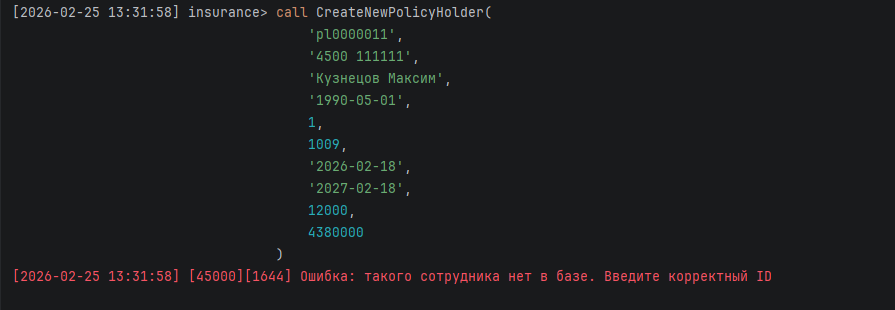
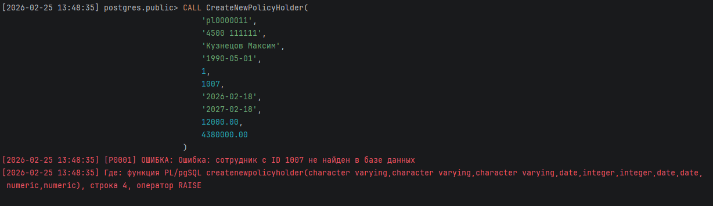

<div>
<h1 align="center">
Вариант 15 Хабибуллин Артём Альбертович
</h1>
<h2 align="center">
Создание Процедур и функций на MySQL и PostgreSQL
</h2>
</div>

---

## Описание базы данных

База данных **insurance** содержит информацию о страховой компании и включает следующие таблицы:

| Таблица             | Описание                                        |
| ------------------- | ----------------------------------------------- |
| **insurance_types** | Виды страхования (авто, путешествия, имущество) |
| **employees**       | Сотрудники страховой компании                   |
| **policyholders**   | Страхователи и их полисы                        |
| **logs**            | Таблица для логирования действий                |

---

## Вызов любой процедуры выполняется через

### MySql

```sql
Call <Название процедуры>(параметры);
```

### Postgres
```sql
Call <Название процедуры>(параметры);
```

---

## <div style="background-color: #aa50ff; height:30px; border-radius: 100px 30px; text-align: center; color: #ffffff"> Процедура 1: Добавление нового договора с проверкой на сотрудника </div>

### Описание процедуры

При добавлений нового договора, проверяем на то существует ли такой сотрудник.

#### MySQL

```sql
delimiter //

create procedure CreateNewPolicyHolder(
    IN p_policy_number varchar(10),
    IN p_passport varchar(50),
    IN p_full_name varchar(40),
    IN p_birth_date date,
    IN p_insurance_type_id smallint,
    IN p_employee_id int,
    IN p_contract_date date,
    IN p_end_date date,
    IN p_premium_amount decimal(10,2), 
    IN p_policy_cost decimal(10,2)
)
begin
    IF NOT EXISTS (SELECT 1 FROM insurance.employees WHERE employee_id = p_employee_id) THEN
        signal sqlstate '45000'
            SET MESSAGE_TEXT = "Ошибка: такого сотрудника нет в базе. Введите корректный ID";
    END IF;

    insert into insurance.policyholders (
        policy_number, passport, full_name, birth_date,
        insurance_type_id, employee_id, contract_date,
        end_date, premium_amount, policy_cost
    )
    values (
        p_policy_number, p_passport, p_full_name, p_birth_date,
        p_insurance_type_id, p_employee_id, p_contract_date,
        p_end_date, p_premium_amount, p_policy_cost
    );
end //

delimiter ;
```

#### PostgreSQL

```sql
CREATE OR REPLACE PROCEDURE CreateNewPolicyHolder(
    p_policy_number VARCHAR(10),
    p_passport VARCHAR(50),
    p_full_name VARCHAR(40),
    p_birth_date DATE,
    p_insurance_type_id INT,
    p_employee_id INT,
    p_contract_date DATE,
    p_end_date DATE,
    p_premium_amount DECIMAL(10,2),
    p_policy_cost DECIMAL(10,2)
)
LANGUAGE plpgsql
AS $$
BEGIN
    IF NOT EXISTS (SELECT 1 FROM employees WHERE id = p_employee_id) THEN
        RAISE EXCEPTION 'Ошибка: сотрудник с ID % не найден в базе данных', p_employee_id;
    END IF;

    INSERT INTO policyholders (
        policy_number, passport, full_name, birth_date, 
        insurance_type_id, employee_id, contract_date, 
        end_date, premium_amount, policy_cost
    )
    VALUES (
        p_policy_number, p_passport, p_full_name, p_birth_date, 
        p_insurance_type_id, p_employee_id, p_contract_date, 
        p_end_date, p_premium_amount, p_policy_cost
    );
END;
$$;
```

### Скриншоты выполнения

> **MySQL:**
>
> 
>
> **PostgreSQL:**
>
> 

---

## <div style="background-color: #aa50ff; height:30px; border-radius: 100px 30px; text-align: center; color: #ffffff"> Процедура 2:</div>

### Описание процедуры

Данная процедура будет пересчитывать стоимость полиса при изменений типа страхования

#### MySQL

```sql

```

#### PostgreSQL

```sql

```

### Скриншоты выполнения

> **MySQL:**
>
> 
>
> **PostgreSQL:**
>
> 

### Итог

> В итоге тригеры удобный инструмент для работы с бд, можно использовать для валидаций, или какой нибудь генераций данных.
>
> В основном очень удобно для логирования информаций
