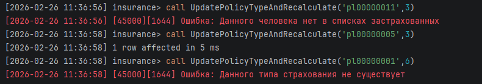
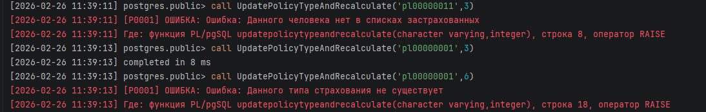
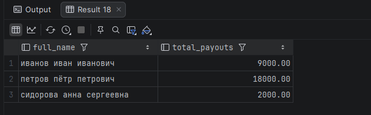
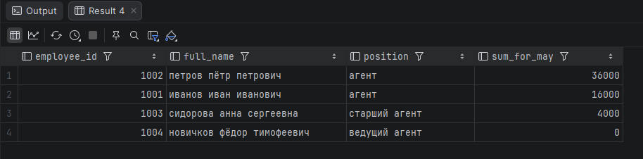
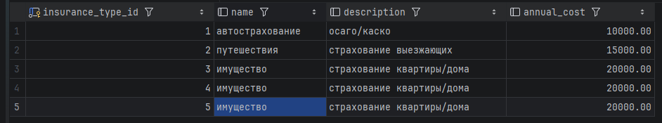
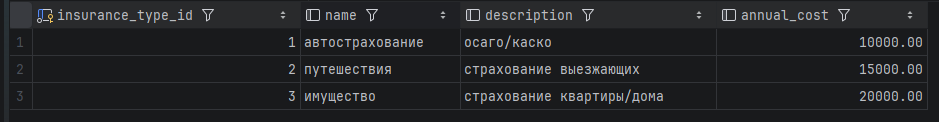
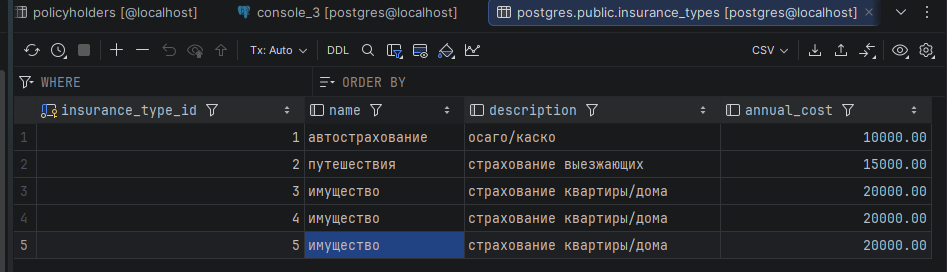
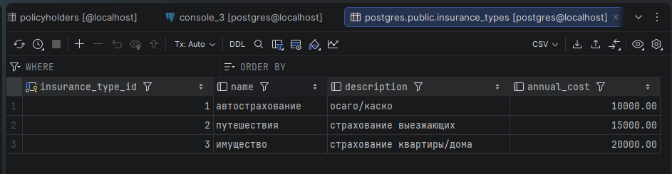
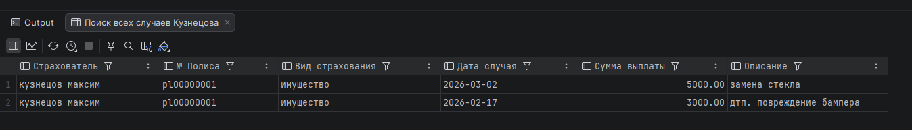
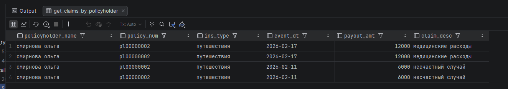

<div>
<h1 align="center">
Вариант 15 Хабибуллин Артём Альбертович
</h1>
<h2 align="center">
Создание Процедур и функций на MySQL и PostgreSQL
</h2>
</div>

---

## Описание базы данных

База данных **insurance** содержит информацию о страховой компании и включает следующие таблицы:

| Таблица             | Описание                                        |
| ------------------- | ----------------------------------------------- |
| **insurance_types** | Виды страхования (авто, путешествия, имущество) |
| **employees**       | Сотрудники страховой компании                   |
| **policyholders**   | Страхователи и их полисы                        |
| **logs**            | Таблица для логирования действий                |

---

## Вызов любой процедуры выполняется через

### MySql

```sql
Call <Название процедуры>(параметры);
```

### Postgres
```sql
Call <Название процедуры>(параметры);
```

---

## <div style="background-color: #aa50ff; height:30px; border-radius: 100px 30px; text-align: center; color: #ffffff"> Процедура 1: Добавление нового договора с проверкой на сотрудника </div>

### Описание процедуры

При добавлений нового договора, проверяем на то существует ли такой сотрудник.

#### MySQL

```sql
delimiter //

create procedure CreateNewPolicyHolder(
    IN p_policy_number varchar(10),
    IN p_passport varchar(50),
    IN p_full_name varchar(40),
    IN p_birth_date date,
    IN p_insurance_type_id smallint,
    IN p_employee_id int,
    IN p_contract_date date,
    IN p_end_date date,
    IN p_premium_amount decimal(10,2), 
    IN p_policy_cost decimal(10,2)
)
begin
    IF NOT EXISTS (SELECT 1 FROM insurance.employees WHERE employee_id = p_employee_id) THEN
        signal sqlstate '45000'
            SET MESSAGE_TEXT = "Ошибка: такого сотрудника нет в базе. Введите корректный ID";
    END IF;

    insert into insurance.policyholders (
        policy_number, passport, full_name, birth_date,
        insurance_type_id, employee_id, contract_date,
        end_date, premium_amount, policy_cost
    )
    values (
        p_policy_number, p_passport, p_full_name, p_birth_date,
        p_insurance_type_id, p_employee_id, p_contract_date,
        p_end_date, p_premium_amount, p_policy_cost
    );
end //

delimiter ;
```

#### PostgreSQL

```sql
CREATE OR REPLACE PROCEDURE CreateNewPolicyHolder(
    p_policy_number VARCHAR(10),
    p_passport VARCHAR(50),
    p_full_name VARCHAR(40),
    p_birth_date DATE,
    p_insurance_type_id INT,
    p_employee_id INT,
    p_contract_date DATE,
    p_end_date DATE,
    p_premium_amount DECIMAL(10,2),
    p_policy_cost DECIMAL(10,2)
)
LANGUAGE plpgsql
AS $$
BEGIN
    IF NOT EXISTS (SELECT 1 FROM employees WHERE id = p_employee_id) THEN
        RAISE EXCEPTION 'Ошибка: сотрудник с ID % не найден в базе данных', p_employee_id;
    END IF;

    INSERT INTO policyholders (
        policy_number, passport, full_name, birth_date, 
        insurance_type_id, employee_id, contract_date, 
        end_date, premium_amount, policy_cost
    )
    VALUES (
        p_policy_number, p_passport, p_full_name, p_birth_date, 
        p_insurance_type_id, p_employee_id, p_contract_date, 
        p_end_date, p_premium_amount, p_policy_cost
    );
END;
$$;
```

### Скриншоты выполнения

> **MySQL:**
>
> 
>
> **PostgreSQL:**
>
> 

---

## <div style="background-color: #aa50ff; height:30px; border-radius: 100px 30px; text-align: center; color: #ffffff"> Процедура 2: Работа с изменением типа страхования</div>

### Описание процедуры

Данная процедура будет пересчитывать стоимость полиса при изменений типа страхования

#### MySQL

```sql
delimeter//
create procedure UpdatePolicyTypeAndRecalculate(
    IN p_policy_number varchar(10),
    IN p_new_type_id int
)
begin
    declare v_new_amount int;
    declare v_new_policy_cost int;

    select annual_cost into v_new_amount from insurance_types where insurance_type_id = p_new_type_id;

    if (select policy_number from policyholders where policy_number = p_policy_number) is null then
        signal sqlstate '45000'
            set message_text = 'Ошибка: Данного человека нет в списках застрахованных';
    end if;

    if (v_new_amount) is null then
        signal sqlstate '45000'
            set message_text = 'Ошибка: Данного типа страхования не существует';
    end if;

    set v_new_policy_cost = v_new_amount * 1.25;

    update policyholders
    set policy_cost = v_new_policy_cost,
        insurance_type_id = p_new_type_id
    where policy_number = p_policy_number;
end //
delimiter ;
```

#### PostgreSQL

```sql
CREATE OR REPLACE PROCEDURE UpdatePolicyTypeAndRecalculate(
    p_policy_number VARCHAR(10),
    p_new_type_id INT
)
LANGUAGE plpgsql
AS $$
DECLARE
    v_new_amount INT;
    v_new_policy_cost INT;
BEGIN
    -- Проверяем существование застрахованного лица
    IF NOT EXISTS (SELECT 1 FROM policyholders WHERE policy_number = p_policy_number) THEN
        RAISE EXCEPTION 'Ошибка: Данного человека нет в списках застрахованных';
    END IF;

    -- Получаем годовую стоимость для нового типа страхования
    SELECT annual_cost INTO v_new_amount
    FROM insurance_types
    WHERE insurance_type_id = p_new_type_id;

    -- Проверяем, существует ли такой тип страхования
    IF v_new_amount IS NULL THEN
        RAISE EXCEPTION 'Ошибка: Данного типа страхования не существует';
    END IF;

    -- Рассчитываем новую стоимость (используем := для присваивания)
    v_new_policy_cost := v_new_amount * 1.25;

    -- Обновляем данные
    UPDATE policyholders
    SET policy_cost = v_new_policy_cost,
        insurance_type_id = p_new_type_id
    WHERE policy_number = p_policy_number;

END;
$$;
```

### Скриншоты выполнения

> **MySQL:**
>
> 
>
> **PostgreSQL:**
>
> 

---

## <div style="background-color: #aa50ff; height:30px; border-radius: 100px 30px; text-align: center; color: #ffffff"> Процедура 3: Расчёт общей суммы выплат за переуд</div>

### Описание процедуры

Расчитать обзую сумму выплат за определёный отрезок времени

#### MySQL

```sql
delimiter //

create function GetEmployeeTotalPayouts(
    p_employee_id int,
    p_start_date date,
    p_end_date date
)
returns decimal(12,2)
deterministic
reads sql data
begin
    declare v_total_payout decimal(12,2);

    if (select employee_id from employees where p_employee_id = employee_id ) is null then
        signal sqlstate '45000'
            set message_text = 'Ошибка: Данного сотрудника нет в списках застрахованных';
    end if;

    select IFNULL(SUM(c.payout), 0)
    into v_total_payout
    from claims c
    join policyholders p on c.policy_number = p.policy_number
    where p.employee_id = p_employee_id
      and c.event_date between p_start_date and p_end_date;

    return v_total_payout;
end //

delimiter ;

SELECT
    e.full_name,
    SUM(c.payout) AS total_payouts
FROM employees e
JOIN policyholders p ON e.employee_id = p.employee_id
JOIN claims c ON p.policy_number = c.policy_number
WHERE
    # e.employee_id = 1001 AND
    c.event_date BETWEEN '2020-01-01' AND '2040-12-31'
GROUP BY e.full_name;
```

#### PostgreSQL

```sql
CREATE OR REPLACE FUNCTION get_employee_total_payouts(
    p_employee_id INT,
    p_start_date DATE,
    p_end_date DATE
)
RETURNS DECIMAL(12,2)
LANGUAGE plpgsql
AS $$
DECLARE
    v_total_sum DECIMAL(12,2);
BEGIN
    -- Считаем сумму выплат по всем полисам, которые оформил данный сотрудник
    SELECT COALESCE(SUM(c.payout), 0)
    INTO v_total_sum
    FROM claims c
    JOIN policyholders p ON c.policy_number = p.policy_number
    WHERE p.employee_id = p_employee_id
      AND c.event_date BETWEEN p_start_date AND p_end_date;

    RETURN v_total_sum;
END;
$$;

SELECT
    employee_id,
    full_name,
    position,
    get_employee_total_payouts(employee_id, '2025-05-01', '2040-05-31') AS sum_for_may
FROM employees
ORDER BY sum_for_may DESC;
```

---

### Скриншоты выполнения

> **MySQL:**
>
> 
>
> **PostgreSQL:**
>
> 

---

## <div style="background-color: #aa50ff; height:30px; border-radius: 100px 30px; text-align: center; color: #ffffff"> Процедура 4: Удаление страховых случаев по условию</div>

### Описание процедуры

Удаление страховок которые не берут

#### MySQL

```sql
delimiter //

create procedure DeleteEmptyInsuranceTypes()
begin
    delete from insurance_types
    where insurance_type_id not in (
        select distinct insurance_type_id
        from policyholders
    );
end //

delimiter ;
```

#### PostgreSQL

```sql

CREATE OR REPLACE PROCEDURE delete_empty_insurance_types()
LANGUAGE plpgsql
AS $$
BEGIN
    DELETE FROM insurance_types it
    WHERE NOT EXISTS (
        SELECT 1 
        FROM policyholders p 
        WHERE p.insurance_type_id = it.insurance_type_id
    );
END;
$$;
```

---

### Скриншоты выполнения

> **MySQL:**
>
> 
> **MySQL:**
>
> 
>
> **PostgreSQL:**
>
> 
> **PostgreSQL:**
>
> 

### Итог

---

## <div style="background-color: #aa50ff; height:30px; border-radius: 100px 30px; text-align: center; color: #ffffff"> Процедура 4: </div>

### Описание процедуры


#### MySQL

```sql
use insurance;
DELIMITER //

create procedure GetClaimsByPolicyholder(
    in p_full_name varchar(100)
)
begin
    select
        p.full_name as 'Страхователь',
        p.policy_number as '№ Полиса',
        it.name as 'Вид страхования',
        c.event_date as 'Дата случая',
        c.payout as 'Сумма выплаты',
        c.description as 'Описание'
    from claims c
    join policyholders p on c.policy_number = p.policy_number
    JOIN insurance_types it on p.insurance_type_id = it.insurance_type_id
    where p.full_name like CONCAT('%', p_full_name, '%')
    order by c.event_date desc;
end //

DELIMITER ;


call GetClaimsByPolicyholder('кузнецов');
```

#### PostgreSQL

```sql
CREATE OR REPLACE FUNCTION get_claims_by_policyholder(p_name TEXT)
RETURNS TABLE (
    policyholder_name VARCHAR,
    policy_num CHAR(10),
    ins_type VARCHAR,
    event_dt DATE,
    payout_amt DECIMAL(12,2),
    claim_desc TEXT
) 
LANGUAGE plpgsql
AS $$
BEGIN
    RETURN QUERY
    SELECT 
        p.full_name,
        p.policy_number,
        it.name,
        c.event_date,
        c.payout,
        c.description
    FROM claims c
    JOIN policyholders p ON c.policy_number = p.policy_number
    JOIN insurance_types it ON p.insurance_type_id = it.insurance_type_id
    WHERE p.full_name ILIKE '%' || p_name || '%' -- ILIKE для поиска без учета регистра
    ORDER BY c.event_date DESC;
END;
$$;

SELECT * FROM get_claims_by_policyholder('смирнова');
```

---

### Скриншоты выполнения

> **MySQL:**
>
> 
> **PostgreSQL:**
>
> 

---

### Итог

> В итоге Процедуры удобный инструмент для работы с бд, можно использовать для быстрого решения проблем в больших бд
>
> В основном очень удобно для исправления ошибок в бд например если ошиблись в каком-то 1 параметре а надо поменять милионы ячеек
