<div>
<h1 align="center">
Вариант 15 Хабибуллин Артём Альбертович
</h1>
<h2 align="center">
Создание триггеров на MySQL и PostgreSQL
</h2>
</div>

---

## Описание базы данных

База данных **insurance** содержит информацию о страховой компании и включает следующие таблицы:

| Таблица             | Описание                                        |
| ------------------- | ----------------------------------------------- |
| **insurance_types** | Виды страхования (авто, путешествия, имущество) |
| **employees**       | Сотрудники страховой компании                   |
| **policyholders**   | Страхователи и их полисы                        |
| **logs**            | Таблица для логирования действий                |

---

## <div style="background-color: #aa50ff; height:30px; border-radius: 100px 30px; text-align: center; color: #ffffff"> Триггер 1: Проверка даты при добавлении страховки </div>

### Описание триггера

Срабатывает при вставке новой записи. Выводит ошибку, если дата начала договора позже даты окончания. В случае успеха логирует операцию.

#### MySQL

```sql
delimiter //
drop trigger if exists db_insert_policyholder_date_checker;
create trigger db_insert_policyholder_date_checker
    before insert on policyholders
    for each row
begin
    if NEW.contract_date > new.end_date then
        signal sqlstate '45000'
            set message_text = "Ошибка: Дата начала договора не может быть позже чем конец";
    else
        insert into logs values (CONCAT('Добавили пользователя с id ', new.policy_number), user());
    end if;
end //
delimiter ;
```

#### PostgreSQL

```sql
create or replace function fn_insert_policyholder_date_checker()
returns trigger as $$
begin
    if new.contract_date > new.end_date then
        raise exception 'ошибка: дата начала договора не может быть позже чем конец';
    else
        insert into logs (message, user_name)
        values (concat('добавили пользователя с id ', new.policy_number), current_user);
    end if;
    return new;
end;
$$ language plpgsql;

create trigger db_insert_policyholder_date_checker
    before insert on policyholders
    for each row execute function fn_insert_policyholder_date_checker();
```

### Скриншоты выполнения

> **MySQL:**
> 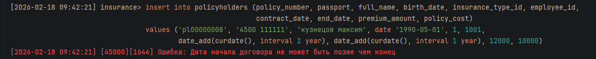
>
> **PostgreSQL:**
> 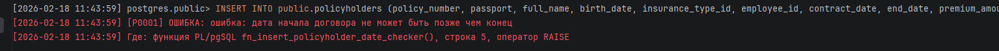

---

## <div style="background-color: #aa50ff; height:30px; border-radius: 100px 30px; text-align: center; color: #ffffff"> Триггер 2: Проверка даты при обновлении </div>

### Описание триггера

Запрещает устанавливать дату начала позже даты окончания при обновлении. Логирует разницу в днях (продление или сокращение договора).

#### MySQL

```sql
delimiter //
drop trigger if exists db_before_update_policyholder_date_checker;
create trigger db_before_update_policyholder_date_checker
    before update on policyholders
    for each row
begin
    if new.contract_date > new.end_date then
        signal sqlstate '45000'
            set message_text = "Ошибка: Дата начала договора не может быть позже чем конец";
    elseif new.end_date > old.end_date then
        insert into logs values (CONCAT('Обновили пользователя с id ', new.policy_number, ' продлён на ', datediff(new.end_date, old.end_date), ' дн.'), user());
    else
        insert into logs values (CONCAT('Обновили пользователя с id ', new.policy_number, ' укорочен на ', datediff(old.end_date, new.end_date), ' дн.'), user());
    end if;
end //
delimiter ;
```

#### PostgreSQL

```sql
create or replace function fn_before_update_policyholder_date_checker()
returns trigger as $$
begin
    if new.contract_date > new.end_date then
        raise exception 'ошибка: дата начала договора не может быть позже чем конец';
    elsif new.end_date > old.end_date then
        insert into logs (message, user_name)
        values (concat('обновили пользователя с id ', new.policy_number, ' продлён на ', (new.end_date - old.end_date), ' дн.'), current_user);
    else
        insert into logs (message, user_name)
        values (concat('обновили пользователя с id ', new.policy_number, ' укорочен на ', (old.end_date - new.end_date), ' дн.'), current_user);
    end if;
    return new;
end;
$$ language plpgsql;

create trigger db_before_update_policyholder_date_checker
    before update on policyholders
    for each row execute function fn_before_update_policyholder_date_checker();
```

### Скриншоты выполнения

> **MySQL:**
> 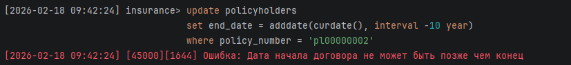
>
> **PostgreSQL:**
> 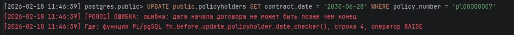

---

## <div style="background-color: #aa50ff; height:30px; border-radius: 100px 30px; text-align: center; color: #ffffff"> Триггер 3: Авторасчет суммы страховки </div>

### Описание триггера

Перед вставкой автоматически рассчитывает `policy_cost` по формуле: Премия \* Количество дней договора.

#### MySQL

```sql
create trigger db_insert_policyholders_calculate_sum
    before insert on policyholders
    for each row
begin
    set new.policy_cost = new.premium_amount * datediff(new.end_date, new.contract_date);
end;
```

#### PostgreSQL

```sql
create or replace function fn_insert_policyholders_calculate_sum()
returns trigger as $$
begin
    new.policy_cost := new.premium_amount * (new.end_date - new.contract_date);
    return new;
end;
$$ language plpgsql;

create trigger db_insert_policyholders_calculate_sum
    before insert on policyholders
    for each row execute function fn_insert_policyholders_calculate_sum();
```

### Скриншоты выполнения

> **MySQL:**
> 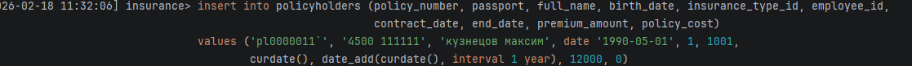
>
> **MySQL test:**
> 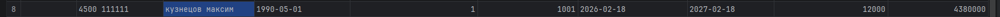
>
> **PostgreSQL:**
> 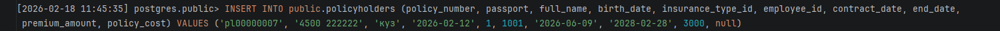
>
> **PostgreSQL:**
> 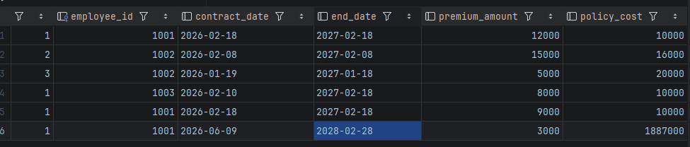


---

## <div style="background-color: #aa50ff; height:30px; border-radius: 100px 30px; text-align: center; color: #ffffff"> Триггер 4: Счетчик договоров сотрудника </div>

### Описание триггера

После добавления нового договора увеличивает поле `count_policyholders` у соответствующего сотрудника.

#### MySQL

```sql
create trigger db_update_employers_if_insert_policyholder
    after insert on policyholders
    for each row
begin
    update employees set count_policyholders = count_policyholders + 1
    where employee_id = NEW.employee_id;
end;
```

#### PostgreSQL

```sql
create or replace function fn_update_employers_if_insert_policyholder()
returns trigger as $$
begin
    update employees
    set count_policyholders = coalesce(count_policyholders, 0) + 1
    where employee_id = new.employee_id;
    return new;
end;
$$ language plpgsql;

create trigger db_update_employers_if_insert_policyholder
    after insert on policyholders
    for each row execute function fn_update_employers_if_insert_policyholder();
```

### Скриншоты выполнения

> **MySQL:**
> 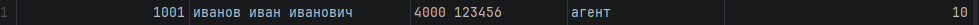
>
> **PostgreSQL:**
> 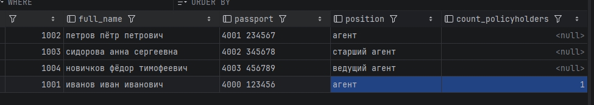

---

## <div style="background-color: #aa50ff; height:30px; border-radius: 100px 30px; text-align: center; color: #ffffff"> Триггер 5: Логирование расторжения договора </div>

### Описание триггера

При удалении записи записывает в логи номер расторгнутого договора и его длительность.

#### MySQL

```sql
create trigger db_remove_set_log
    before delete on policyholders
    for each row
begin
    insert into logs values (CONCAT('Договор: ', old.policy_number, ' расторгнут за ', datediff(old.end_date, old.contract_date), ' дн.'), user());
end;
```

#### PostgreSQL

```sql
create or replace function fn_remove_set_log()
returns trigger as $$
begin
    insert into logs (message, user_name)
    values (concat('договор: ', old.policy_number, ' был росторжен за ', (old.end_date - old.contract_date), ' дней'), current_user);
    return old;
end;
$$ language plpgsql;

create trigger db_remove_set_log
    before delete on policyholders
    for each row execute function fn_remove_set_log();
```

### Скриншоты выполнения

> **MySQL:**
> 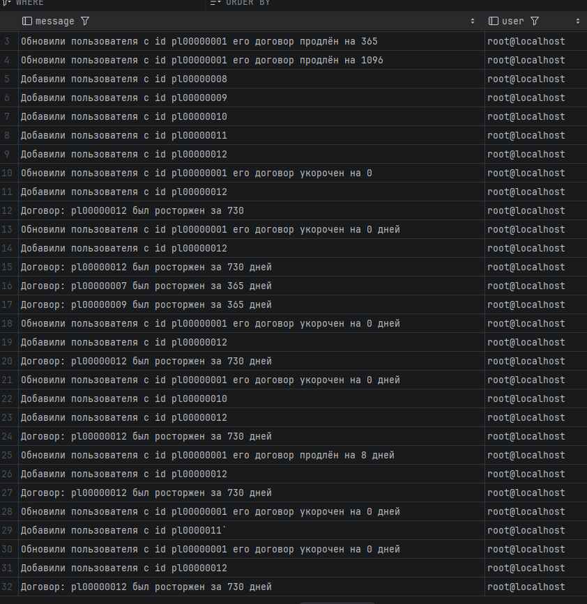
>
> **PostgreSQL:**
> 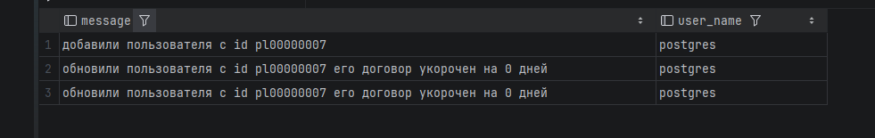
